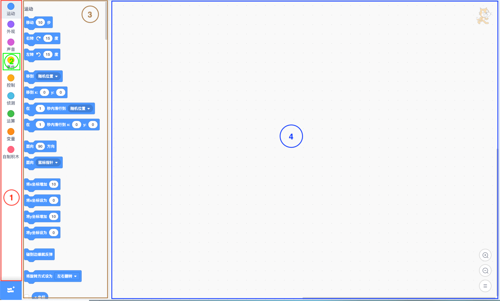

# Scratch Blocks简述
我们先从UI来了解Scratch Blocks界面的组成：


### Toolbox
红色框部分叫做Toolbox，用来展示所有的积木分类，会根据用户的选择显示某个选中分类下的所有积木。
### Category
红色框中绿色部分表示一个分类Category，Scratch Blocks中默认有运动Motion、外观Looks、声音Sound、事件Events、控制Control、侦测Sensing、运算Operators、变量Variables和自制积木My Blocks，还可以通过添加扩展来添加新的积木分类。每个分类都对应着若干积木块。分类可以被用户选中，被选中后该分类下的积木就会被显示出来。
### Flyout
棕色框则是Flyout，是分类被选中后呈现积木的容器（其实是flyoutWorkspace 的容器），其中一个个蓝色的块就是积木块Block，每个Block就是Scratch中一个独立的程序方法。
### Workspace
最大面积蓝色框是mainWorkspace，是Workspace的一个实例，之所以称之为mainWorkspace，是因为它并不是Workspace唯一的实例，Flyout中同样有一个实例称为flyoutWorkspace。Workspace可以理解为是Blocks的容器。flyoutWorkspace中的Block只能拖出，却不能自由拖动改变位置，拖出到mainWorkspace中即表示创建了一个新的Block；mainWokrspace中的Block可以自由拖动位置，当被拖到Flyout或Toolbox 上方式表示即将被删除。我们通常的操作就是从flyoutWorkspace中拖出积木放到mainWorkspace中去自由的编辑组合。

Toolbox、Category、Flyout、Workspace和Block是我们从 UI 中第一眼看到的Scratch Blocks的重要组成对象，细心地读者还可以发现flyoutWorkspace和mainWorkspace都有的滚动条 Scrollbars，在 mainWorkspace 中是既有竖向的也有横向的，而flyoutWorkspace中只有一个竖向的。还可以看到mainWokrspace右下角有三个按钮，它们属于ZoomControls，分别用来放大、缩小、还原mainWorkspace中的积木大小。

而我们在浏览器上看到的都是一个个渲染好的Dom节点，一个个分类Category是div + span，而Flyout、Workspace和Scrollbars则是一个个的svg，Blocks则是由各种svg元素g、path、text等组成。那么这些节点是怎么渲染的呢？

### Xml
负责将XML文档解析成DOM节点，将DOM代表的积木渲染到Workspace上。还可以将Workspace中的Blocks转化成XML字符串。简单的代码示例如下：

xml字符串渲染成积木
```javascript
    // 一个 xml 字符串，包含若干个 block
    const xmlText = '<xml><block type="motion_xposition" /></xml>';
    // 通过方法转化成了浏览器的 DOM 对象
    const xmlDom = Blockly.Xml.textToDom(xmlText);
    // 将 DOM 对象再解析成 block 渲染到目标 workspace 中，这时候就可以在浏览器上看到积木块了
    const blockIds = Blockly.Xml.domToWorkspace(xmlDom, Blockly.mainWorkspace);
```
获取workspace的xml字符串
``` javascript
    // 将 workspace 中的积木转化成 DOM 对象
    const xmlDom = Blockly.Xml.workspaceToDom(Blockly.mainWorkspace);
    // 将 DOM 对象转成 XML 字符串
    const xmlText = Blockly.Xml.domToText(xmlDom);
```

这也是Scratch3.0中角色切换，工作区积木也会跟着切换的原理，这点会在之后再补充说明。

我们从这里就可以看到Block和XML文档中的block标签是一一对应关系，事实也是Toolbox中的所有分类Category和积木 Block 对应了一个完整的XML树，这个XML可以在 [Scratch Gui](https://github.com/LLK/scratch-gui/blob/develop/src/lib/make-toolbox-xml.js) 项目的 `src/lib/make-toolbox-xml.js` 中找到，如果你对这个js里category和block标签的结构有些其奇怪，或者在想是不是可以随便定义一个category或block就可以在浏览器上显示出来，那么可以浏览后边的章节，看看Block是由什么构成的，如何自己定义一个Block和Category。
